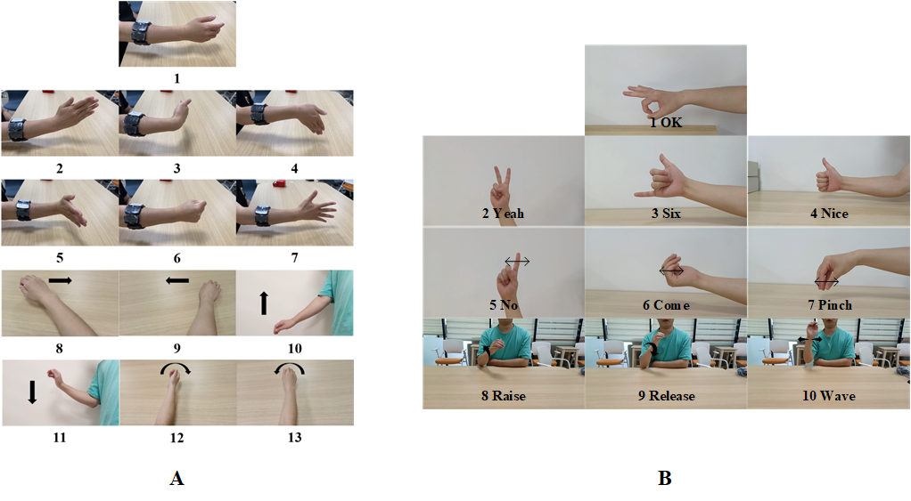

# XDMyo

## Protocols

### Subject

There were 21 able-bodied participants in this study. Approval of the experiment was granted by the Research Ethics Committee of Xidian University.

### MYO

A Myo armband, equipped with sEMG and IMU sensors, was used to capture gestures activity. After wearing the Myo armband, each participant was required to perform a hardware calibration procedure. The procedure is to straighten the five fingers together and bend the wrist outward by 90 degrees until the MYO armband cease vibrating.

### Signal

The eight-channel sEMG signals were collected at a 200-Hz sampling rate. The three-channel acceleration signals (Acc) and three-channel gyroscope signals (Gyro) were captured at a 50-Hz sampling rate.

### Sequence

During the data acquisition, each type of gesture was executed in six repetitive trials. To prevent muscle fatigue, there was a 5 s rest between trials.

Participants performed each static gesture within 5 s and each dynamic gesture within 3 s.

## Gesture

| Folder | Label | Class |      Name      |Duration(s)|
|:------:|:-----:|:-----:|:--------------:|:---------:|
| A      |   1   |static |Neutral         |     5     |
| A      |   2   |static |Redial Deviation|     5     |
| A      |   3   |static |Flexion         |     5     |
| A      |   4   |static |Ulnar Deviation |     5     |
| A      |   5   |static |Extension       |     5     |
| A      |   6   |static |Hand Close      |     5     |
| A      |   7   |static |Hand Open       |     5     |
| A      |   8   |dynamic|Yaw Right       |     3     |
| A      |   9   |dynamic|Yaw Left        |     3     |
| A      |   10  |dynamic|Pitch Above     |     3     |
| A      |   11  |dynamic|Pitch Below     |     3     |
| A      |   12  |dynamic|Roll Exterior   |     3     |
| A      |   13  |dynamic|Roll Interior   |     3     |
| B      |   1   |static |OK              |     5     |
| B      |   2   |static |Yeah            |     5     |
| B      |   3   |static |Six             |     5     |
| B      |   4   |static |Nice            |     5     |
| B      |   5   |dynamic|NO              |     5     |
| B      |   6   |dynamic|Come            |     5     |
| B      |   7   |dynamic|Pinch           |     5     |
| B      |   8   |dynamic|Raise Hand      |     2     |
| B      |   9   |dynamic|Release Hand    |     2     |
| B      |   9   |dynamic|Wave Hand       |     2     |

`0` indicates a rest phase between the same gestures, and `-1` indicates a rest phase between different gestures.

## Paper

The Paper is currently under submission to IEEE Sensors, and utilized Dataset A.

In XDMyo-A, the raw signal data of the 21 subjects included 1,638 (13 × 21 × 6) gestures. The dataset was partitioned into the source-dataset and the target-dataset. The source-dataset comprised data from 15 participants.

## Authors

Guiyin Li, Bo Wan, Kejia Su, Jiwang Huo, Changhua Jiang, Fei Wang
